# 模块化设计与流程图

本文面向代码审查和长期维护，按模块说明插件化执行系统的职责边界、调用关系、关键流程和异常处理路径。图示使用 Mermaid，可在 GitHub、GitLab、VS Code Mermaid 插件或支持 Mermaid 的 Markdown 工具中直接渲染。

## 1. 总体架构

系统采用“主程序 + 插件运行时 + 外部插件进程”的分层结构。主程序不感知具体业务插件，只知道插件 manifest 和统一 JSON 协议。

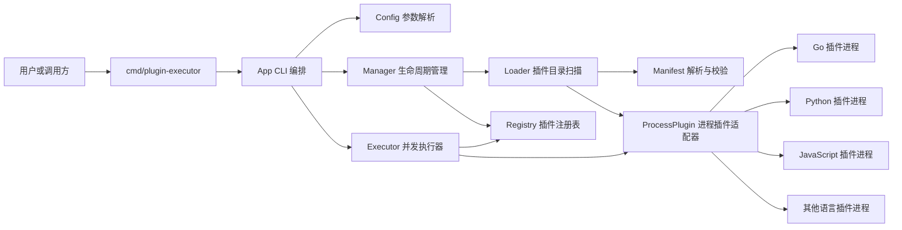

### 模块边界

| 模块 | 关键文件 | 职责 | 不负责 |
| --- | --- | --- | --- |
| CLI | `cmd/plugin-executor/main.go` | 进程入口，调用应用层并返回退出码 | 参数细节、业务逻辑 |
| App | `internal/app/app.go` | CLI 应用编排、watch 模式、输入输出、信号处理 | manifest 解析、插件执行细节 |
| Config | `internal/config/cli.go` | 命令行参数解析和默认值 | 插件运行时状态 |
| Manager | `internal/core/manager.go` | 组织加载、热加载、注册表生命周期 | 执行插件业务 |
| Loader | `internal/loader/loader.go` | 扫描插件目录、加载 manifest、创建插件适配器 | 判断依赖是否满足 |
| Manifest | `internal/loader/manifest.go` | 配置解析、默认值、字段校验、路径解析 | 插件运行 |
| Model | `internal/model/types.go` | 插件领域模型、状态模型、manifest 模型 | 加载或执行流程 |
| Registry | `internal/registry/registry.go` | 插件状态、启用禁用、依赖和版本约束校验 | 启动外部进程 |
| Executor | `internal/executor/executor.go` | 并发执行、结果汇总、失败隔离、降级 | 解析 manifest |
| ProcessPlugin | `internal/executor/process.go` | 通过进程运行插件、协议编解码、超时终止 | 业务处理 |
| Version | `internal/version/version.go` | 版本约束解析和比较 | 依赖图管理 |
| Protocol | `pkg/protocol/protocol.go` | 插件请求和响应 JSON 结构 | 传输层选择 |
| SDK | `pkg/sdk/sdk.go` | Go 插件协议编解码辅助 | 主程序运行时管理 |

## 2. CLI 模块

CLI 是系统入口，保持尽量薄。`cmd/plugin-executor` 只调用 `internal/app`；参数解析由 `internal/config` 承担，应用编排由 `internal/app` 承担。

### 关键能力

- `-plugins` 指定插件 manifest 目录。
- `-input` 或 `-input-file` 提供 JSON 输入。
- `-list` 查询插件状态。
- `-watch` 周期扫描插件目录，展示热加载和热卸载。
- `-enable` 和 `-disable` 临时调整插件启用状态。
- `-parallelism` 控制执行并发度。

### CLI 调用流程

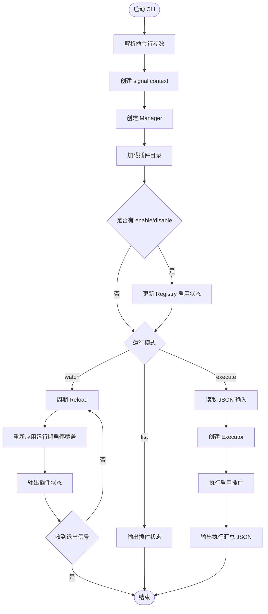

### 设计约束

- CLI 输出统一使用 JSON，便于脚本、测试或上层系统消费。
- `cmd` 层不放业务逻辑；新增 server 或 daemon 入口时可以复用 `internal/core`、`internal/loader`、`internal/registry` 和 `internal/executor`。
- 插件启用状态的持久化由 manifest 或未来管理 API 负责。

## 3. Manager 模块

Manager 是 Loader 和 Registry 的协调者，负责插件生命周期入口。

### 关键能力

- `Reload(ctx)`：重新扫描插件目录并替换注册表。
- `Watch(ctx)`：按固定周期调用 `Reload`，实现无输出的后台热加载和热卸载。
- `Close()`：关闭注册表中已加载的插件适配器。

CLI 的 `-watch` 模式为了持续打印当前状态，由 `internal/app.watchStates` 周期调用 `Manager.Reload()`；每轮 reload 后会重新应用 `-enable` / `-disable` 运行期覆盖。核心热加载逻辑仍然复用 `Reload -> Registry.Replace`。

### 热加载和热卸载流程

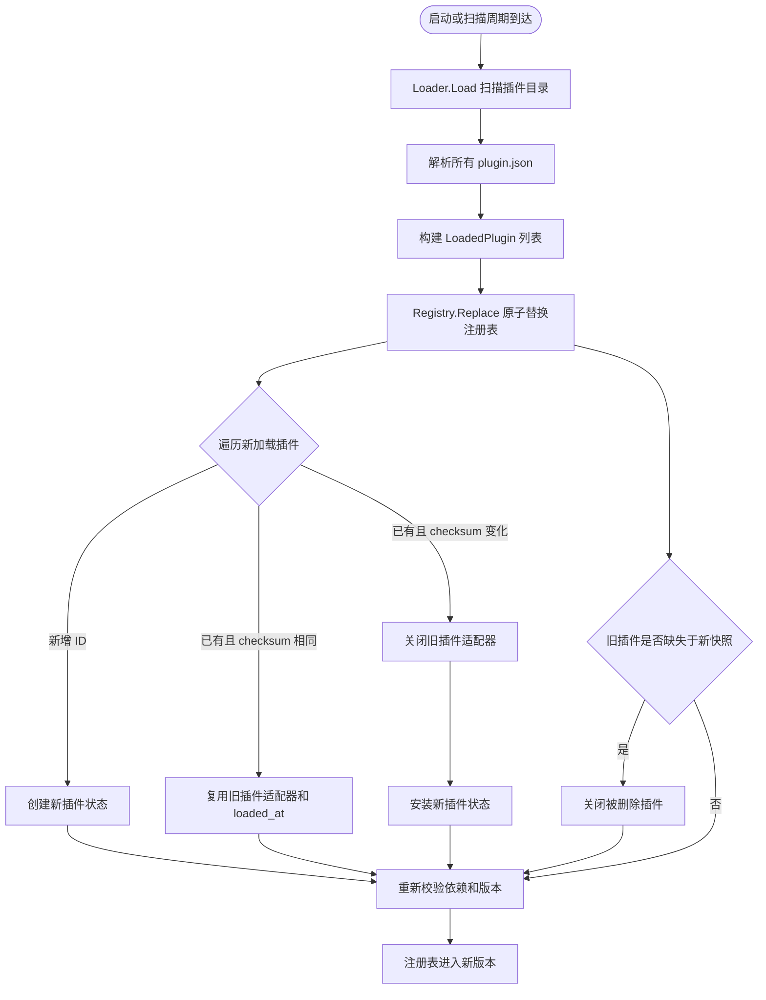

### 生命周期说明

热加载采用轮询扫描，不依赖平台文件事件能力。每轮加载会产生新的注册表快照；manifest 未变化时复用已有插件适配器，manifest 变化或插件删除时调用旧适配器的 `Close()`，为未来引入长连接插件、预热插件或资源句柄释放留下扩展点。

## 4. Loader 与 Manifest 模块

Loader 负责发现插件，Manifest 负责描述插件。两者共同保证主程序只依赖配置，不依赖具体插件源码。

### Manifest 关键字段

| 字段 | 说明 |
| --- | --- |
| `id` | 插件唯一 ID，用于注册、依赖和启用禁用 |
| `name` | 插件展示名称 |
| `version` | 插件版本，用于依赖约束 |
| `type` | 插件类型标识，如 `go-process`、`python-process` |
| `enabled` | 默认是否启用 |
| `command` / `args` | 外部进程启动命令 |
| `working_dir` | 插件工作目录，相对 manifest 所在目录解析 |
| `timeout` | 单插件执行超时 |
| `depends_on` | 依赖插件和版本约束 |
| `fallback` | 失败或超时时的降级结果 |

### 加载流程

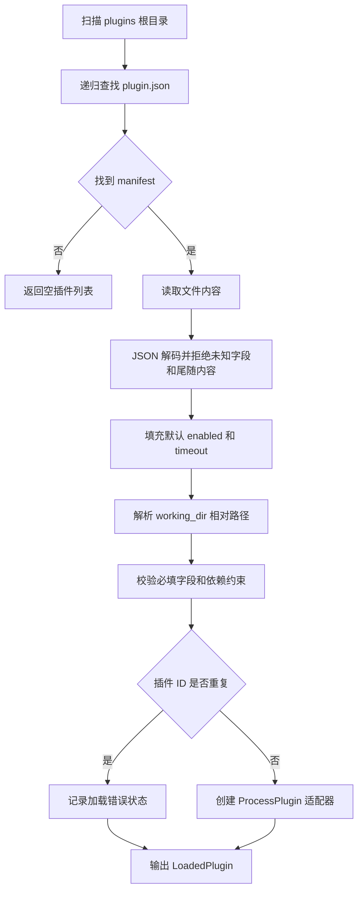

### 设计取舍

- 使用 `plugin.json` 作为插件发布边界，插件实现可以在任何目录或独立仓库。
- JSON 解码拒绝未知字段和尾随内容，避免拼写错误或半坏配置静默生效。
- `working_dir` 相对 manifest 解析，插件目录搬迁后仍能保持自包含。

## 5. Registry 模块

Registry 是系统状态中心，负责把加载结果转换为可执行插件集合。

### 状态模型

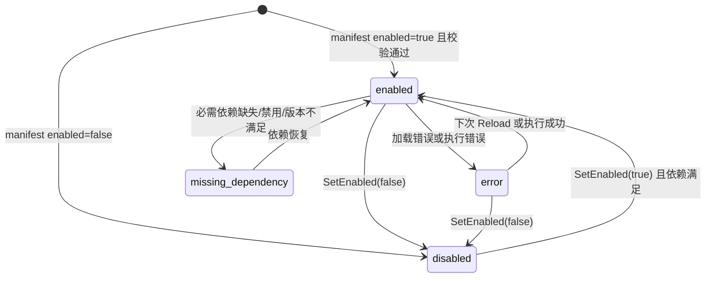

### 依赖校验流程

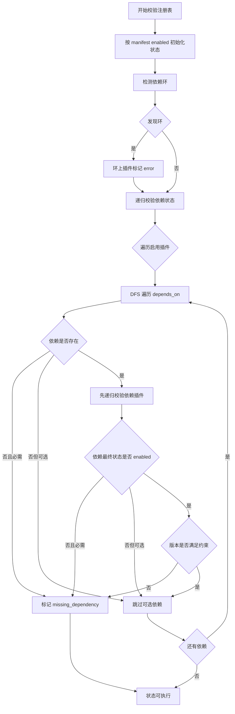

### 并发安全

Registry 使用读写锁保护内部 map：

- `Replace`、`SetEnabled`、`MarkExecution`、`Close` 获取写锁。
- `States`、`EnabledPlugins`、`Fallback` 获取读锁。
- Executor 获取的是当前可执行插件快照，单个插件失败后再回写对应状态。

## 6. Executor 模块

Executor 负责实际执行插件并汇总结果。它不关心插件来自哪种语言，只依赖 `Plugin` 接口。

### 执行流程

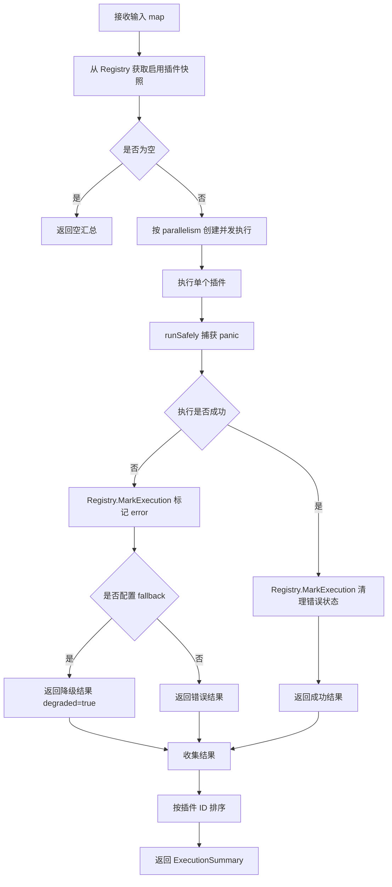

### 结果结构

每个插件执行结果包含：

- 插件元信息：`id`、`name`、`version`、`type`。
- `duration`：单插件耗时。
- `result`：插件成功结果或 fallback 结果。
- `error`：失败原因。
- `degraded`：是否使用降级结果。

## 7. ProcessPlugin 与协议模块

ProcessPlugin 是插件隔离边界。它把统一 `Plugin` 接口适配为外部进程调用。

### 进程执行流程

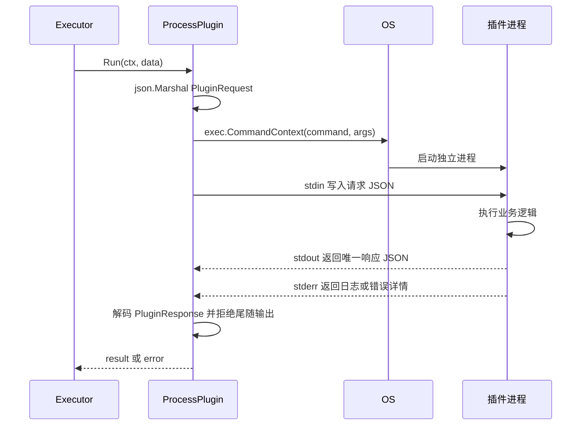

### 超时终止流程

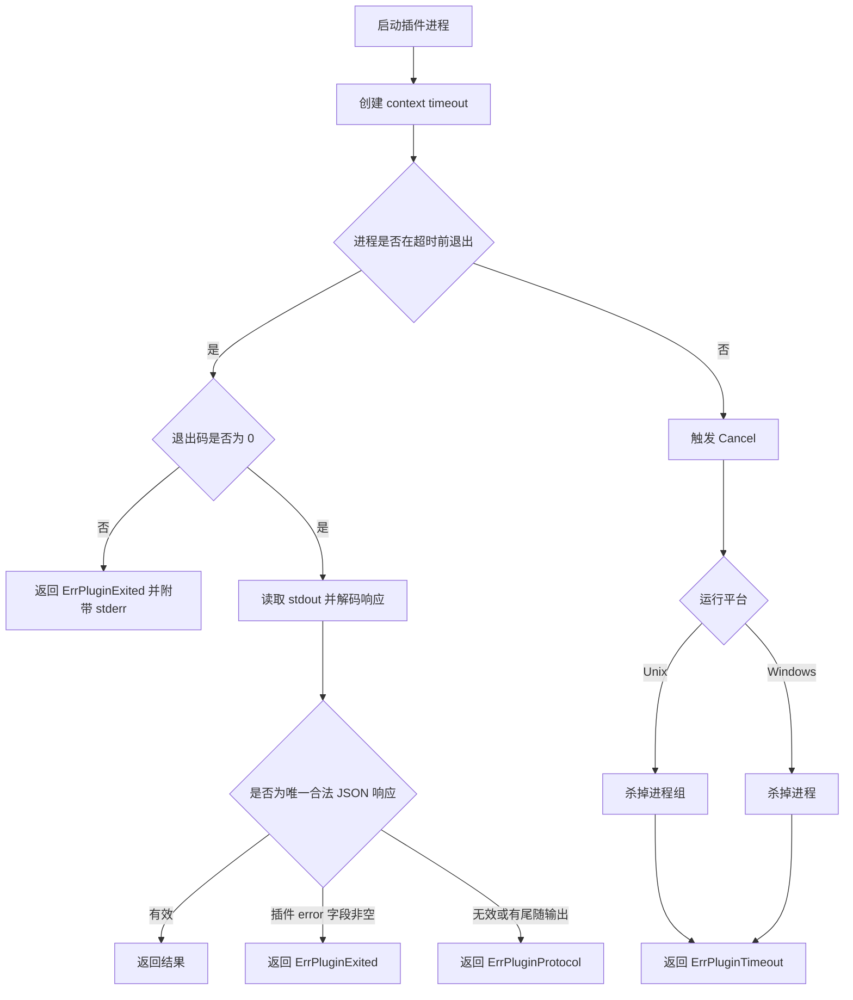

### 协议约束

请求：

```json
{
  "data": {
    "text": "hello"
  }
}
```

响应：

```json
{
  "result": {
    "words": 1
  }
}
```

错误：

```json
{
  "error": "invalid input"
}
```

插件 stdout 必须只输出一个协议 JSON，日志写入 stderr。主程序会拒绝未知响应字段、多个 JSON 值和尾随 stdout 内容，这样可以稳定区分协议响应与插件日志。

## 8. 失败隔离与降级模块

失败隔离贯穿 Loader、Registry、Executor 和 ProcessPlugin。

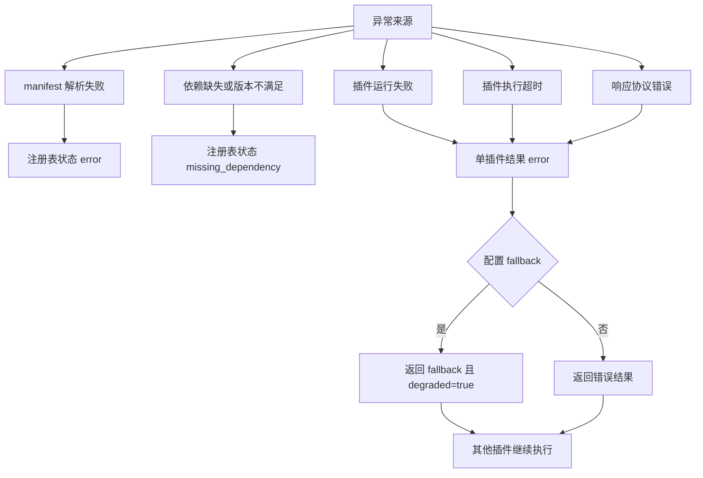

### 当前降级策略

- 降级数据由 manifest 的 `fallback` 静态配置提供。
- 降级不吞掉真实错误，输出中同时包含 `error` 和 fallback `result`。
- 降级只影响当前插件，不影响其他插件执行。

## 9. 多语言插件模块

系统把语言差异隔离在外部进程内。只要插件遵守 JSON 协议，就能接入。

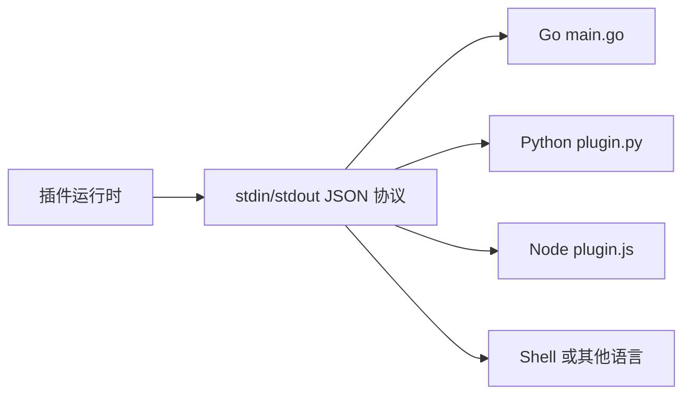

### 当前示例插件

| 插件 | 源码 | manifest | 功能 |
| --- | --- | --- | --- |
| `go.echo` | `examples/plugins/go_echo/main.go` | `plugins/go_echo/plugin.json` | 回显输入数据并返回处理时间 |
| `go.word_stats` | `examples/plugins/go_word_stats/main.go` | `plugins/go_word_stats/plugin.json` | 统计 `text` 字符数、单词数和空文本 |
| `go.slow` | `examples/plugins/go_slow/main.go` | `plugins/go_slow/plugin.json` | 故意超时，验证隔离和降级 |
| `python.uppercase` | `examples/plugins/python_uppercase/plugin.py` | `plugins/python_uppercase/plugin.json` | 输出 `text` 的大写形式和长度 |
| `js.reverse` | `examples/plugins/js_reverse/plugin.js` | `plugins/js_reverse/plugin.json` | 输出 `text` 的反转形式和长度 |

## 10. 一次完整执行的端到端流程

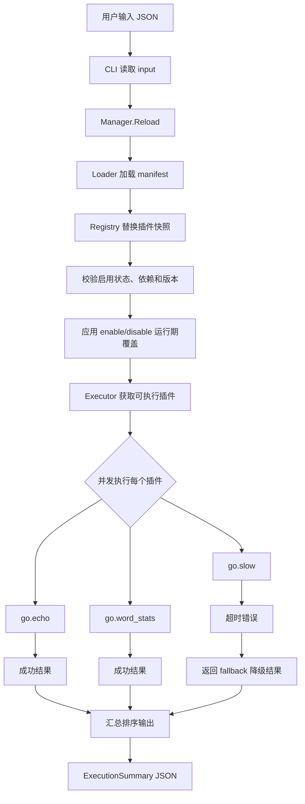

## 11. 模块扩展点

| 扩展方向 | 推荐落点 | 兼容性说明 |
| --- | --- | --- |
| 管理 API | 新增 `cmd/plugin-server` 或 `internal/app` 上层服务 | 不改变插件协议 |
| 文件事件热加载 | 替换 `Manager.Watch` 的触发源 | `Reload` 和 `Registry.Replace` 保持不变 |
| 插件签名校验 | `Loader` 或 `Manifest` 校验阶段 | 不影响 Executor |
| 容器隔离 | `ProcessPlugin` 启动命令封装为容器运行时 | 插件仍走 stdin/stdout JSON |
| DAG 顺序执行 | `Executor` 中根据依赖图分层调度 | Registry 依赖校验逻辑可复用 |
| 动态降级策略 | `Executor` 或新增 fallback provider | 结果结构保持兼容 |

## 12. 维护准则

- 新增业务插件不能被主程序 import，只能通过 manifest 加入。
- 新增插件类型应优先复用进程协议；除非有强需求，不新增主程序内嵌业务接口。
- Registry 是状态源，Executor 不应自行解释依赖关系。
- ProcessPlugin 是隔离边界，插件日志不得写入 stdout。
- README 保持入口说明，细节沉淀到 `docs/`。
